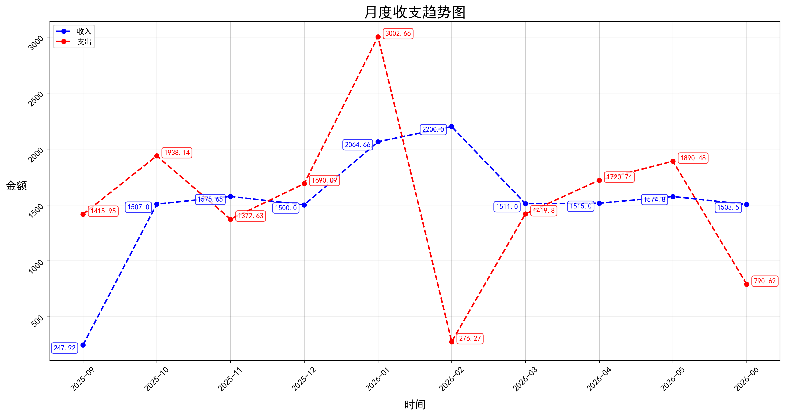
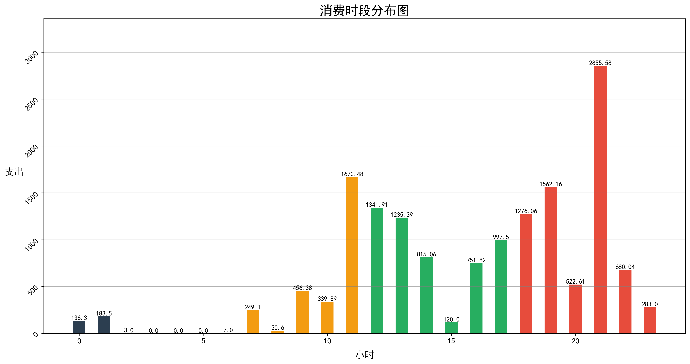
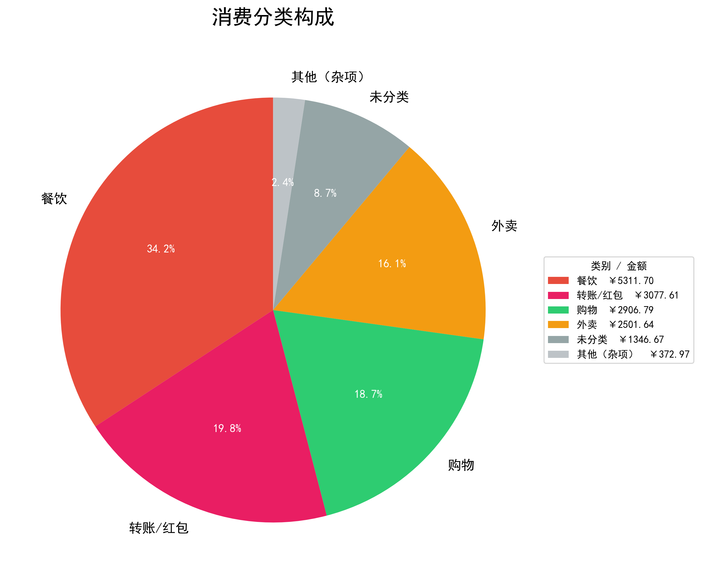

# 微信账单分析

> 当前版本：v0.1.1

一个自动分析微信账单、生成可视化图表的 Python 脚本。

## 功能

| 输出文件 | 说明 |
|---------|------|
| `月度收支趋势图.png` | 按月汇总收入与支出，对比趋势 |
| `消费时段分布图.png` | 24小时消费分布，识别消费高峰 |
| `消费分类饼图.png` | 按关键词自动归类支出，展示消费结构 |

## 第三方库

| 库 | 作用 |
|----|------|
| pandas | 数据处理，读取 Excel 账单 |
| matplotlib | 画图库，生成折线图、柱状图 |
| openpyxl | Excel 文件解析引擎 |

## 运行方法

### 安装依赖

```bash
pip install -r requirements.txt
```

### 准备数据

1. 下载或克隆本项目
2. 从微信导出账单（Excel 格式），放入项目根目录，命名为 `datas.xlsx`

### 运行脚本
```bash
python analysis.py
```

### 运行结果
| 输出文件   | 预览                                      |
| ------ | --------------------------------------- |
| 月度收支趋势 |  |
| 消费时段分布 |  |
| 消费分类构成 |  |

### 数据说明
- 时间范围：自动识别账单起止时间
- 过滤规则：剔除无效数字（含/的特殊行）
- 精度：金额保留二位小数